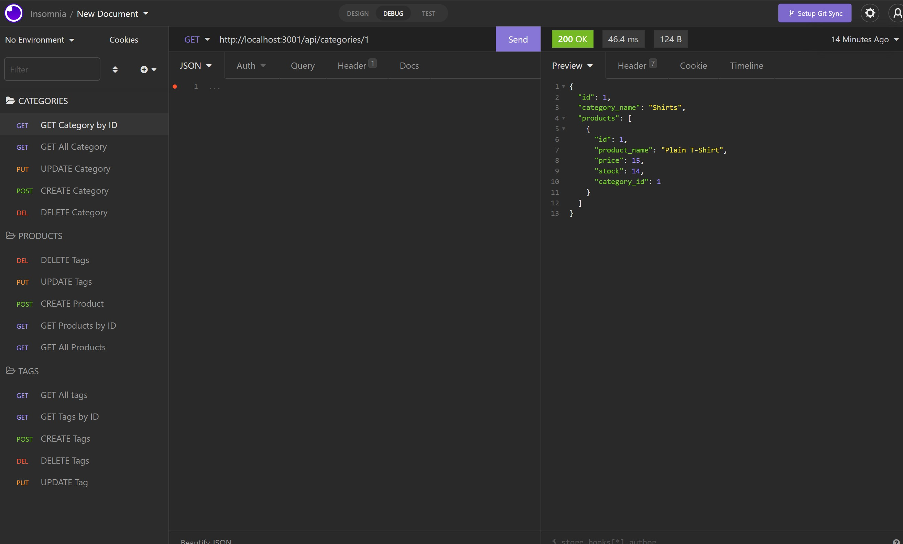

# E-commerce Back End Starter Code (https://github.com/BlerandIsm/fantastic_umbrella)

  []

  ## Description:
  AS A manager at an internet retail company
  I WANT a back end for my e-commerce website that uses the latest technologies
  SO THAT my company can compete with other e-commerce companies

  ## Table of Contents
  - [Description](#description)
  - [Installation](#installation)
  - [Usage](#usage)
  - [Contribution](#contribution)
  - [Testing](#testing)
  - [Questions](#questions)
  - [Screenshot](#Screnshot)

  ## Installation:
  To install this application, the user must clone the repo into their system , install the dependencies required for Node.js to work such as Expres.js and Sequelize. The user then should run their database (mysql -u root -p), enter their password and source the db which in this case is schema.sql. Exit the database by pressing "exit" or "quit" then enter "npm run see" to run the seed file. As final command run "npm start" which will call the main function "server.js" 

  ## Usage:
  The user needs to run “server.js” on the command-line and then answer the questions one by one to get the result. 

  ## License:
  This project is cover under the license type BSD
  [Click here for more information](https://opensource.org/licenses/BSD-2-Clause)

  ## Contribution:
  Everyone who need to modify and make the code better and more functional is welcomed to contribute as long as they respect the author work and cite it in the end. 

  ## Testing:
  The project will be tested on my terminal first and recorded on the screen to show the functionality. 

  ## Screenshot
  - 

  ## Questions:
  - Github: [BlerandIsm](https://github.com/BlerandIsm)
  - Email: ismailiblerand@gmail.com 
